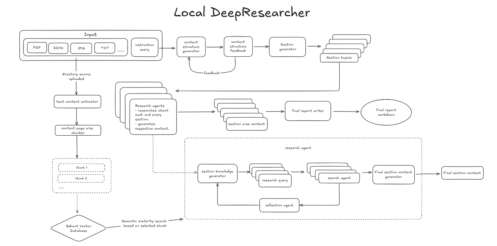

<div align="center">
  
</div>
<p align="center">
  <a href="https://github.com/Datalore-ai/deepdoc/stargazers"></a>
  <a href="https://github.com/Datalore-ai/deepdoc/blob/main/LICENSE"></a>
  <a href="https://github.com/Datalore-ai/deepdoc/commits/main"></a>
  
  <a href="https://github.com/Datalore-ai/deepdoc/graphs/contributors"></a>
</p>

<div align="center">
  
</div>

## Overview

DeepDoc is a tool that performs deep research on your local resources instead of the internet. It uses a research-style workflow to explore your documents, organize the findings, and generate a clear markdown report. This way, you can quickly uncover insights from your own files without manually digging through them.


## How It Works  

- Start by uploading local resources (PDF, DOCX, JPG, TXT, etc.).  
- The system extracts text and splits it into page-wise chunks.  
- These chunks are stored in a vector database for semantic similarity search.  
- Based on your instruction query, a content structure is generated.  
- You can provide feedback to refine the structure.  
- The tool then generates report sections and section topics.  
- For each section, research agents:  
  - Generate knowledge for the section.  
  - Create research queries.  
  - Run search agents over the chunked local data.  
  - Use reflection agents to refine results.  
  - Generate final section content.  
- Section-wise content is compiled and passed to a final report writer.  
- The output is a complete, structured report in markdown format.  


## Workflow  

This diagram shows how Local DeepResearcher takes your local resources and instructions, processes and analyzes the content, and turns it into a structured report.  




---

## Getting Started

Follow these steps to set up and run the project locally.

### Prerequisite: Install `uv`

`uv` is required to manage the virtual environment and dependencies.

You can download it from the official [uv GitHub repository](https://github.com/astral-sh/uv), which includes platform-specific installation instructions.

### 1. Clone the Repository

```bash
git clone https://github.com/Datalore-ai/deepdoc.git
cd deepdoc
```

### 2. Create a Virtual Environment

Use `uv` to create a virtual environment:

```bash
uv venv
```

### 3. Activate the Virtual Environment

Activate the environment depending on your OS:

**Windows:**
```bash
.venv\Scripts\activate
```

**macOS/Linux:**
```bash
source .venv/bin/activate
```

### 4. Set Up Environment Variables

Copy the example `.env` file and add your API keys:

```bash
cp .env.example .env
```

Open the `.env` file in a text editor and fill in the required fields:

```
MISTRAL_API_KEY=
TAVILY_API_KEY=
OPENAI_API_KEY=

# Default
QDRANT_URL=http://localhost:6333
COLLECTION_NAME=knowledge_base
EMBEDDING_MODEL=BAAI/bge-small-en-v1.5
QDRANT_DISABLE_THREADING=true # Don't change this
```

These keys are essential for the application to work correctly.

### 5. Install Dependencies

Install required packages using:

```bash
uv pip install -r requirements.txt
```

### 5. Set Up Docker for Qdrant vectorDB

Make sure you have Docker and Docker Compose installed. Then start the required services (e.g., Qdrant) using:

```bash
docker-compose up --build
```

This will spin up the necessary services in the background.

### 6. Run the Application

Once the environment and services are ready, start the application:

```bash
python main.py
```

You're all set to go! The application will now guide you through the dataset creation process step by step and the final dataset will be saved in the output_files directory.

### Optional: `configuration.py`

You can customize how the tool behaves using the `configuration.py` file. It lets you adjust 2 parameters for this application.

```python
import uuid

LLM_CONFIG = {
    "provider": "openai",
    "model": "gpt-4o-mini", 
    "temperature": 0.5,
}

THREAD_CONFIG = {
    "configurable": {
        "thread_id": str(uuid.uuid4()),
        "max_queries": 3,
        "search_depth": 2,
        "num_reflections": 2,
        "n_points": 1,
    }
}
```

## Authors

- [Swaraj Biswal](https://github.com/SWARAJ-42)
- [Swadhin Biswal](https://github.com/swadhin505)  


## Contributing

If something here could be improved, please open an issue or submit a pull request.

### License

This project is licensed under the MIT License. See the `LICENSE` file for more details.